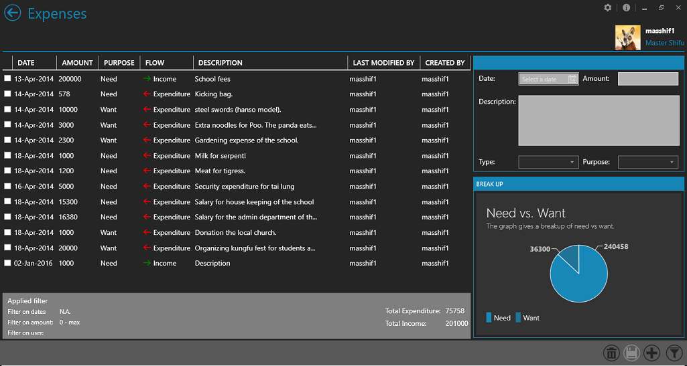
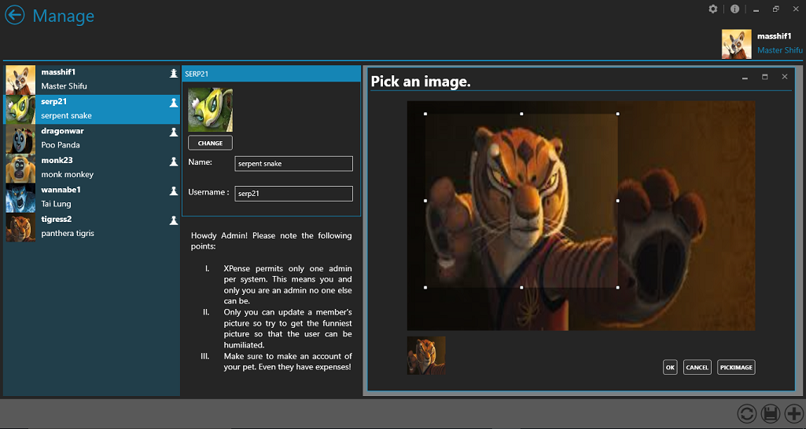

<div id="top"></div>

<div align="center">
  <a href="https://github.com/OxyProgrammer/XPence">
    
  </a>
  <br/>
  <h1 align="center"><u>XPence</u></h1>


  <p align="center">
    A MVVM- smart client WPF Model.
    <br />
     <a href="https://www.codeproject.com/Articles/753332/XPence-A-WPF-metro-style-smart-client-expense-trac"><strong>Read the article »</strong></a>
     <br/>
    <a href="https://github.com/OxyProgrammer/XPence/issues">Report Bug</a>
    ·
    <a href="https://github.com/OxyProgrammer/XPence/issues">Request Feature</a>
  </p>
  </div>

[](https://github.com/OxyProgrammer/XPence/issues)
[](https://github.com/OxyProgrammer/XPence/network)
[](https://github.com/OxyProgrammer/XPence/stargazers)
[](https://github.com/OxyProgrammer/XPence)

<!-- ABOUT THE PROJECT -->

## About The Project

XPence started as a demo application to deepen my understanding of UI practices.
Gradually it became a labour of love and a nice demonstration of WPF-MVVM.
The project demonstrates:

- MVVM without any DI framework.
- Custom control creation.
- Messaging service to show modals.
- How to use MahApps metro.

Its been a while I moved to Web Development from Desktop based. And hence I am no longer working actively on this project. However, I will be happy to take change requests or any questions!

<p align="right">(<a href="#top">back to top</a>)</p>

## Getting Started

1. Clone the repo
   ```sh
   git clone https://github.com/OxyProgrammer/XPence.git
   ```
2. To build the code you would need Visual Studio 2012 (or Higher).
Few external dlls are also used but they are packaged with the source code so you need not worry about getting them separately. For persisting data MS SQL Server CE is used. Before you could run the application you will need MS SQL Server CE 4.0. It involves a few points to consider before you actually install it. [Read this before you install](https://support.microsoft.com/en-gb/topic/fix-you-receive-an-error-message-when-you-run-a-sql-server-compact-3-5-based-application-after-you-install-the-32-bit-version-of-sql-server-compact-edition-3-5-service-pack-2-on-an-x64-computer-c402cea6-35c0-52e9-4fc0-172082d1038b).

3. If you don't want to install SQL Server CE 4.0 there is still a way out. Download the SQL Server CE dlls (SQLDlls) from the top of [this](https://www.codeproject.com/Articles/753332/XPence-A-WPF-metro-style-smart-client-expense-trac) page and place the two folders (amd64 and x86) inside the Output directory (refer Directory structure).
Go to the app.config file of XPence project and uncomment the system.data tag.
Rebuild the project and it should work. 

4. [Read this code project article for more info.](https://www.codeproject.com/Articles/753332/XPence-A-WPF-metro-style-smart-client-expense-trac)

5. You will need to punch in the login credentials. Try any of the following.
		
|S.No|User id|Password (case sensitive)|Role|
| ----------- | ----------- |--------|------|
|1| masshif1|XPense123|Admin|
|2|	serp21|XPense123|User|
3|dragonwar|XPense123|User|
4|monk23|XPense123|User|
5|wannabe1|XPense123|User|
6|tigress2|XPense123|User|

<p align="right">(<a href="#top">back to top</a>)</p>

## Screenshots

Here are a few screenshots, to motivate you.😃

1. Home:


2.  Users dashboard:



3. You may crop images and set a dp:



<p align="right">(<a href="#top">back to top</a>)</p>

## Article

A [code project article](http://www.codeproject.com/Articles/753332/XPence-A-WPF-metro-style-smart-client-expense-trac) exists, explaining the architecture followed by XPence.

<!-- LICENSE -->
## License

Distributed under the MIT License. See `LICENSE` for more information.

<p align="right">(<a href="#top">back to top</a>)</p>


<!-- CONTACT -->
## Contact

OxyProgrammer  - oxyprogrammer@gmail.com

Project Link: [https://github.com/OxyProgrammer/XPence](https://github.com/OxyProgrammer/XPence)

<p align="right">(<a href="#top">back to top</a>)</p>
