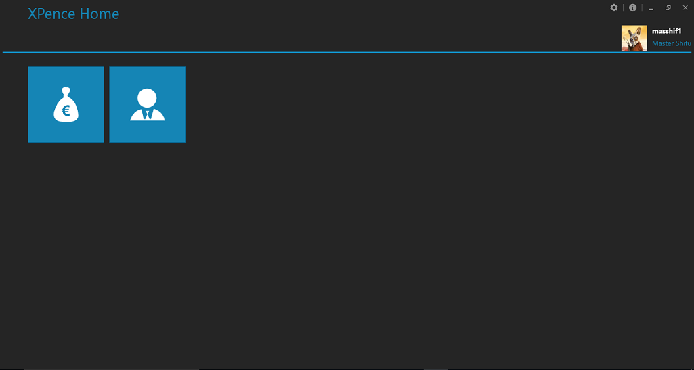

# XPence
XPence started as a demo application to deepen my understanding of UI practices. 
Gradually it became a labour of love and a good demonstration of WPF-MVVM.

## Screenshots
Here are a few screenshots to give you an idea how XPence looks.

###Home:

###Users dashboard:

###You may crop images and set a dp:

## Article

A [code project article](http://www.codeproject.com/Articles/753332/XPence-A-WPF-metro-style-smart-client-expense-trac) exists, explaining the architecture followed by XPence.

